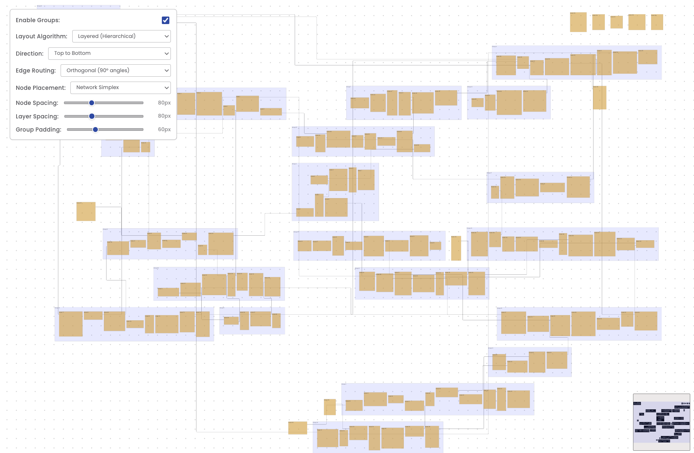

# Foblex Flow + ELK.js Integration Example

A sophisticated graph visualization application that combines **Foblex Flow** (Angular flow diagram library) with **ELK.js** (Eclipse Layout Kernel) for automatic graph layout. This example demonstrates how to create complex hierarchical diagrams with automatic layout algorithms.



## 🚀 Features

### Layout Algorithms

- **Layered (Hierarchical)** - Sugiyama-style hierarchical layout
- **Force-Directed** - Physics-based organic layout
- **Stress Minimization** - Optimized edge length distribution
- **Tree (MR-Tree)** - Specialized tree structure layout

### Interactive Controls

- **Enable/Disable Groups** - Toggle between grouped and flat layouts
- **Direction Control** - Configure flow direction (Top-to-Bottom, Left-to-Right, etc.)
- **Edge Routing** - Choose between Orthogonal, Polyline, or Splined edges
- **Node Placement** - Multiple strategies (Network Simplex, Brandes Koepf, Linear Segments)
- **Spacing Controls** - Adjustable node spacing, layer spacing, and group padding
- **Real-time Updates** - All changes trigger immediate layout recalculation

### Graph Features

- **Hierarchical Groups** - Support for nested node groups
- **Cross-level Edges** - Connections between nodes at different hierarchy levels
- **Draggable Elements** - Interactive node and group positioning
- **Minimap** - Overview navigation for large graphs
- **Zoom & Pan** - Smooth canvas navigation
- **Responsive Design** - Adapts to different screen sizes

## 🛠️ Tech Stack

- **Angular 19** - Modern web framework
- **Foblex Flow** - Flow diagram visualization library
- **ELK.js** - Automatic graph layout engine
- **TypeScript** - Type-safe development
- **SCSS** - Advanced styling
- **Poppins Font** - Clean typography

## 📦 Installation

```bash
# Clone the repository
git clone https://github.com/yourusername/foblex-flow-elkjs-example.git

# Navigate to project directory
cd foblex-flow-elkjs-example

# Install dependencies
pnpm install

# Start development server
pnpm start
```

The application will be available at `http://localhost:2000`

## 🏗️ Project Structure

```
src/app/
├── components/
│   └── layout-controls/          # Reusable layout control component
│       ├── layout-controls.component.ts
│       ├── layout-controls.component.html
│       └── layout-controls.component.scss
├── models/
│   └── graph.interface.ts       # Type definitions for graph elements
├── services/
│   └── elk-layout.service.ts    # ELK.js layout integration service
├── app.component.ts              # Main application component
├── app.component.html            # Main template
└── app.component.scss            # Main styles
```

## 🎨 Key Components

### ElkLayoutService

Handles all graph layout calculations using ELK.js:

- Converts Foblex graph data to ELK format
- Applies layout algorithms with configurable options
- Extracts calculated positions for rendering
- Supports hierarchical layouts with cross-level edges

### LayoutControlsComponent

Standalone component for layout configuration:

- Encapsulates all control UI and logic
- Emits configuration changes to parent
- Type-safe with `LayoutConfig` interface
- Fully styled with Poppins font

### Graph Generation

- Creates random nodes with varying sizes
- Generates hierarchical group structures
- Establishes random edge connections
- Supports both grouped and flat layouts

## 🔧 Configuration Options

### Layout Algorithms

```typescript
algorithm: 'layered' | 'force' | 'stress' | 'mrtree'
```

### Direction (for applicable algorithms)

```typescript
direction: 'RIGHT' | 'DOWN' | 'LEFT' | 'UP'
```

### Edge Routing (layered only)

```typescript
edgeRouting: 'ORTHOGONAL' | 'POLYLINE' | 'SPLINES'
```

### Node Placement (layered only)

```typescript
nodePlacement: 'NETWORK_SIMPLEX' | 'BRANDES_KOEPF' | 'LINEAR_SEGMENTS'
```

### Spacing Parameters

- `nodeSpacing`: 20-200px
- `layerSpacing`: 20-200px (layered only)
- `groupPadding`: 10-150px (when groups enabled)

## 📝 Usage Example

```typescript
// Configure layout options
const layoutConfig: LayoutConfig = {
  enableGroups: true,
  algorithm: 'layered',
  direction: 'DOWN',
  edgeRouting: 'ORTHOGONAL',
  nodePlacement: 'NETWORK_SIMPLEX',
  nodeSpacing: 80,
  layerSpacing: 80,
  groupPadding: 60
};

// Calculate layout
const result = await elkLayoutService.calculateLayout(
  { groups, nodes, edges, enableGroups },
  layoutConfig
);
```

## 🚦 Development

```bash
# Run development server
pnpm start

# Build for production
pnpm build

# Run tests
pnpm test

# Lint code
pnpm lint
```

## 📄 License

MIT License - feel free to use this example in your projects.

## 🤝 Contributing

Contributions are welcome! Please feel free to submit a Pull Request.

## 🔗 Resources

- [Foblex Flow Documentation](https://flow.foblex.com/)
- [ELK.js Documentation](https://www.eclipse.org/elk/)
- [Angular Documentation](https://angular.io/)

## 👏 Acknowledgments

- **Foblex** team for the excellent flow diagram library
- **Eclipse Foundation** for ELK layout algorithms
- **Angular** team for the powerful framework

---

Built with ❤️ using Foblex Flow and ELK.js
